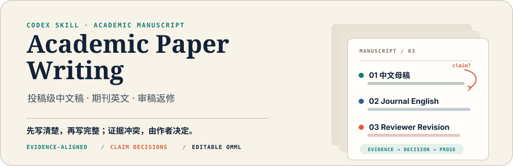
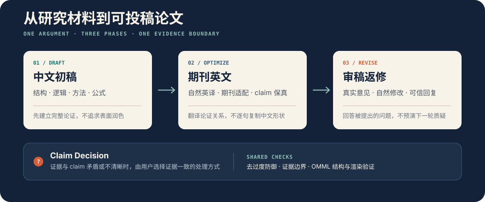

<p align="center">
  
</p>

<p align="center">
  <strong>把真实研究证据写成结构清楚、语言自然、不过度防御的学术论文。</strong>
</p>

`academic-paper-writing` 是一个面向学术论文正文的 Codex Skill。它覆盖中文初稿、目标期刊英文优化和投稿后返修，并在 Word 文稿中使用可继续编辑的 OMML 公式。

它不会把每句话写成提前答辩，也不会用模糊限定掩盖证据与 claim 的冲突。真正不清楚的科学判断会形成一个简洁的 `Claim Decision`，由用户选择证据一致的处理方式。

## 一条可控的论文写作路径

<p align="center">
  
</p>

## 三个阶段

| 阶段 | 主要目标 | 默认结果 |
| --- | --- | --- |
| **初稿** | 用中文建立研究问题、文献缺口、方法、实验、结论和必要公式之间的完整逻辑 | 结构完整、证据边界清楚的中文论文初稿 |
| **优化** | 进行段落级学术英译，并按照用户确定的目标期刊和文章类型调整内容与格式 | 自然的英文稿及期刊适配结果 |
| **返修** | 分析真实编辑与审稿意见，修改正文并在需要时撰写逐点回复 | 自然融入修改的论文和可信的 response letter |

每次只加载当前阶段的详细规则。涉及文献依赖型内容时加载文献检索与期刊写作研究规则；完整论文、重大修订或复合任务加载稿件质量控制规则；涉及实质写作时共享去过度防御检查，涉及 Word 数学时再加载 OMML 规则。

作者要求对现有稿件作实质修订时，Skill 另外启用作者修订路由：最新作者版本是唯一文字起点，但版本链中尚未落实的作者要求不会因生成了新版本或修改说明而自动关闭。Skill 会区分目标、硬约束和建议手段，并以最终稿中的实际论证变化验收，而不是以段落数量、文字差异或 DOCX/Markdown 同步代替内容完成。

## 文献依赖型写作硬门槛

检索条件按学术论断触发，不按章节名称触发。只要任务新增、改变、解释、比较或核实依赖外部文献的内容，就必须先完成相应检索。这包括背景与意义、创新定位、理论依据、方法选择、比较分析、实验解释、讨论、局限、应用语境、未来工作、审稿回复以及图表中的学术说明。

| 工作范围 | 文献要求 |
| --- | --- |
| 单一引用或窄事实 | 打开并核实原始文献中的准确命题与位置 |
| 局部综合、机制比较或结果解释 | 定向检索所有直接相关工作；综合性判断通常至少依据 3 篇全文原始论文 |
| 完整期刊稿、重大章节、跨研究分支或创新性定位 | 执行完整检索、全文研究、目标期刊写作规律分析和检索饱和检查 |

完整期刊稿采用自适应检索量，而不是统一配额。通常先以筛查约 20–30 篇、全文精读约 8–12 篇、研究约 3–5 篇近期目标期刊写作范例作为计划区间；跨多个研究分支、涉及强创新性主张或持续发现新证据时继续扩大，窄领域或局部问题则可以收窄。真正的硬门槛是覆盖所有进入正文的重要研究分支、逐一核实点名比较方法和最接近创新性的工作，并继续到追加检索与引用追踪不再改变方法类别、竞争关系或 claim。不会为了达到数字而阅读无关论文，也不会因为达到数字便提前停止。

必要全文无法取得时，Skill 会依次尝试出版社、DOI、开放获取版本、作者稿或预印本、机构知识库、本地 Zotero 和已授权连接。需要机构或出版社权限时，可以请用户在自己的浏览器或连接流程中登录，或提供合法取得的 PDF；不会要求用户在对话中发送密码、Cookie、访问令牌或验证码。

Skill 会在稿件之外保留检索记录、source-claim matrix 和跨论文 rhetorical-pattern map。它学习多篇优秀论文如何建立问题、组织研究脉络、推出缺口、衔接方法并界定贡献，但不会复制某篇论文的句子、特色措辞或整套结构。文献数量、关键词和日志文件存在本身不能代替内容验收。

## 复合任务的职责分离与复核

完整期刊稿、重大多章节修订，或同时承担文献写作与数学推导、证据重建、数值核验、平台事实、图表、补充材料、DOCX/LaTeX 等技术工作的任务，必须把“形成候选稿”和“依据原始要求与直接证据验收候选稿”分开。子代理和独立审稿人是可选实现，不是固定流程：

```text
直接文献与项目证据
          |
          v
   单一权威候选稿
          |
          +--> 独立审稿人或子代理（适合复杂、高风险任务）
          +--> 分阶段 source-first 复核（无需独立代理时）
          +--> 数值、引用、公式、DOCX 与渲染工具检查
          |
          v
      修订并重新核验
```

若采用多个代理，它们不会同时覆盖同一份权威稿件。研究与核验代理提交带有准确来源位置的证据包，主笔承担最终文字和事实责任。所有数值、统计、创新性、方法刻画、比较、因果、临床、政策和当前平台事实都必须直接核实；出现矛盾时回到原始证据，而不是以多数意见决定。

若采用独立审稿人，其必须读取作者原始要求、权威基线、冻结候选稿和直接证据，但不读取主笔的完成自评或预期结论。若不采用独立审稿，则在候选稿冻结后重新从作者原始要求和证据建立验收清单，进行与起草过程分离的复核。只有 `Blocker` 和 `Major` 问题全部解决才能宣称完成；交付说明会准确写明采用了独立审稿、专家核验、分阶段自检或其他哪一种方式，绝不把自检称为独立审稿。

当任务需要创建或实质修改 DOCX 时，Skill 还会加载学术稿件专用规则：期刊模板和原稿样式优先；无模板的中文初稿使用 A4，标题和正文均采用宋体中文与 Times New Roman 西文，仅通过字号、粗细和间距建立层级；表格和算法默认采用三线表；Windows 已安装 Word 时优先用 Word 验证最终稿，LibreOffice 作为可用时的备用或跨平台检查。

## 它如何控制 claim

当拟写 claim 的含义、范围、创新身份、因果解释或证据支持存在实质矛盾时，Skill 不会自行加上一串 `可能`、`一定程度上` 或 `potentially` 来回避问题，而是提交一个紧凑的决策项：

```text
拟写 claim
    ↓
支持证据 ── 矛盾或不清晰处
    ↓
对论文的实际影响
    ↓
2–3 个证据一致的方案 + 推荐方案
    ↓
用户决定
```

只暂停受影响的 claim；其他可以可靠完成的章节继续推进。用户决定的是科学上可成立的表达路线，而不是把缺失证据变成既定结果。

## 默认写作姿态

| 原则 | Skill 的实际行为 |
| --- | --- |
| 主张先行 | 先写核心判断，再写机制、证据和必要边界 |
| 不预设反对意见 | 只处理证据、文献、目标读者、编辑或审稿人真正提出的问题 |
| 信息具体 | 用条件、机制和结果替代“我并不极端”式的态度管理 |
| 一段一个中心 | 不强迫每段同时讨论优势、局限、风险、替代路线和未来工作 |
| 限定集中出现 | 重要边界放在它改变结果解释的位置，不在全文重复 |
| 英译不抬高 claim | 保留原始证据强度，不自动加入优势、稳健性或泛化性结论 |
| 返修不刻意 | 回复信直接回答，论文正文像原本就应这样写，而不是持续对审稿人说话 |

`需要强调的是`、`this does not imply` 或 `not merely ... but ...` 等表达不是禁词。Skill 检查的是它们是否承担真实逻辑功能；删除后事实、逻辑和边界均不变化时才删除。

## Word 原生数学公式

DOCX 输出使用可编辑的 Office Math Markup Language：

- 行内数学使用 `<m:oMath>`；展示公式使用 `<m:oMathPara>`；
- 分式、上下标、根式、求和、积分、括号和矩阵使用真实 OMML 结构；
- 不用公式截图、Unicode 伪公式或残留 LaTeX 代替；
- 变量、向量、矩阵、函数和运算符遵循目标期刊或 Word 模板的数学排版；
- 交付前检查 OOXML 结构，并渲染核对公式、编号、换行和特殊符号。

LaTeX 论文继续使用原生 LaTeX 数学，不强行转换成 OMML。

## 中文初稿的简洁格式与数值

- 中文初稿只保留清楚的标题层级、正文、公式、图表和参考文献，不自动加入“技术注与补充材料索引”、证据清单或制作说明。
- 标题样式显式设置中文宋体、西文和数字 Times New Roman，不依赖可能解析为 MS Gothic 或 Calibri 的 Word 主题字体。
- 普通表格和算法块默认使用三线表，不使用全网格、项目符号或无必要的单元格 `keepNext` 设置。
- AUC、ACC 等率类性能指标默认按百分比呈现；普通数值默认保留两位小数。整数计数、p 值、阈值及两位小数会掩盖实质差异的情况按其专门规则处理。
- 百分比之间的绝对差异写为“百分点”，不与相对百分比变化混用；底层数据和中间计算不因展示取舍而舍入。

## 科研插图与结果图

Skill 会先判断图像承担的是“解释”还是“证据”：

- 流程图、原理图、机制示意和方法概览等不承载实测结果的科研展示图，直接使用内置 ImageGen 当前默认的最新模型，不在 Skill 中固定模型版本。
- 所有性能曲线、消融图、热图、嵌入图、统计图、资源比较、真实样本数量流程图及其他结果图，都必须由本地真实数据和可复现代码生成，不使用生图模型。
- 精确文字、公式、变量、数字和 panel 标号不依赖生图模型猜测，必要时以可编辑方式叠加并逐项核对。
- 图片中的中文文字默认宋体，英文、数字和西文符号默认 Times New Roman；结果图的坐标轴、图例和标注遵守相同规则。
- 同一稿件先建立统一的配色、线条、箭头、图标、字体、留白和纵深风格，后续生成图复用同一风格提示及已确认的参考图。
- 图片按目标期刊单栏、双栏或文档正文可用宽度确定插入尺寸，保持纵横比，并在最终显示大小下检查字号、清晰度、题注间距和分页；放不下时重排或拆分，不把图压缩到难以阅读。
- 生成前核对目标期刊的尺寸、分辨率、格式、颜色和 AI 图像政策；生成图只承担示意作用，不能被写成实验或观测证据。

## Zotero 与动态引用

Zotero 是按需启用的引用能力，而不是本 Skill 的硬依赖。当用户要求使用 Zotero、稿件包含可能受编辑影响的 Zotero 动态引用域，或确实需要从本地文献库检索引用时，Skill 会调用可用的 Zotero 能力。

- 本地库检索和 BibTeX 导出可以按需进行；向 Zotero 库导入记录仍需明确授权。
- LaTeX 和 Markdown 可以插入 Zotero 导出的 citation key；Word 中的动态引用必须通过 Zotero Word 加载项或其他经过验证的域保留路径处理。
- 不把 Zotero 引用域拍平成普通文本，也不宣称尚未实际执行的刷新已经完成。
- 参考文献字体和悬挂缩进优先通过 CSL 与 Word 的 `Bibliography` 样式控制，避免逐条直接格式在刷新后丢失。

## 安装

### 推荐

```bash
npx skills add Dreiot/academic-paper-writing
```

### Windows PowerShell

```powershell
git clone https://github.com/Dreiot/academic-paper-writing.git `
  "$env:USERPROFILE\.codex\skills\academic-paper-writing"
```

### macOS / Linux

```bash
git clone https://github.com/Dreiot/academic-paper-writing.git \
  ~/.codex/skills/academic-paper-writing
```

重新启动或刷新 Codex 后即可调用 `$academic-paper-writing`。

## 使用示例

### 中文初稿

```text
使用 $academic-paper-writing，根据当前方法设计、实验表格和已有文献，
撰写论文中文初稿。对所有依赖外部学术知识的内容先完成相应检索，并从
目标期刊高质量论文中学习其论证组织；再建立问题、缺口、方法和实验结论之间的完整逻辑，
公式使用 Word 原生 OMML；证据与 claim 冲突时交给我决定。
```

### 作者主导的实质修订

```text
使用 $academic-paper-writing，以我最新修改的稿件和本轮具体意见为准，
实质修订引言与相关工作。先区分我要达到的论证目标、必须保留的约束和
仅供参考的组织手段；完成必要的文献检索后由单一主笔整合，再采用适合本任务的
独立审稿或 source-first 复核。对照最终稿核实每项要求，不以改写字数、段落数量或修改说明代替实际落实。
```

### 英文优化与期刊适配

```text
使用 $academic-paper-writing，将这份中文稿优化成适合目标期刊
Information Sciences 的英文论文。保持现有证据强度，先修复段落逻辑，
再进行自然英译和期刊格式适配。
```

### 审稿返修

```text
使用 $academic-paper-writing，结合编辑决定、审稿意见、当前论文和上一轮回复信，
完成本轮返修。只回应真实意见及其必要科学关切，不扩展审稿人没有提出的问题，
并同步核验论文与 response letter 中的修改位置和数值。
```

## 与 Codex Research Workflow 的关系

本 Skill 可以独立使用。普通论文撰写不会自动创建 Goal、Gate、证据包、正式审查或 Git 事务。

当论文位于受治理科研项目中时，它会读取当前 `AGENTS.md`、`docs/PROJECT_CORE.md`、`docs/CURRENT_STAGE.md` 和必要证据，避免使用过时结果或越过 claim 边界，但不会把这些内部状态写进论文。只有用户明确同时调用 [`$codex-research-workflow`](https://github.com/Dreiot/codex-research-workflow)，或任务本身已经是受治理 Goal 时，才组合执行两套工作流。

## 文件结构

```text
academic-paper-writing/
├── SKILL.md
├── README.md
├── agents/
│   └── openai.yaml
├── references/
│   ├── drafting.md
│   ├── author-revision.md
│   ├── literature-and-rhetoric.md
│   ├── manuscript-quality-control.md
│   ├── optimization.md
│   ├── revision.md
│   ├── anti-overdefense.md
│   ├── omml.md
│   ├── docx-manuscript.md
│   ├── numeric-reporting.md
│   ├── zotero.md
│   └── scientific-figures.md
└── assets/readme/
    ├── hero.svg
    └── workflow.svg
```

## 使用边界

- 不虚构引用、实验、数学推导、审稿人意图或已经完成的修改。
- 不擅自运行实验、改变研究方法、提交论文或提升论文 claim。
- 不把普通翻译、文献检索、科研讨论报告和日常 Word 编辑路由到本 Skill。
- 不用内部 Git、Gate、review-state 或 artifact 术语污染面向读者的论文正文。
- 覆盖原稿、执行外部提交或改变项目权威状态仍需要明确授权。
